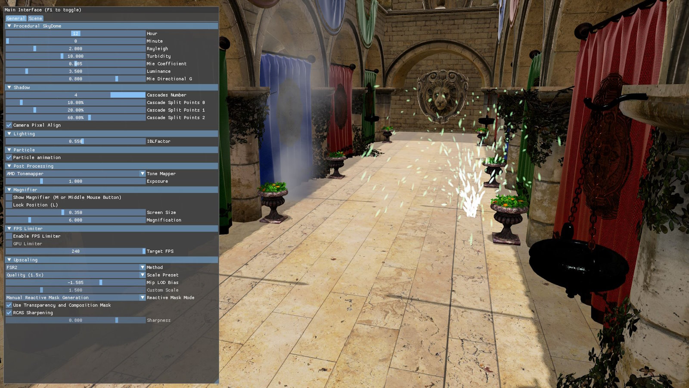

<!-- @page page_samples_super-resolution FidelityFX Super Resolution -->

<h1>FidelityFX Super Resolution</h1>

This sample demonstrates the use of FidelityFX Super Resolution (FSR1) and FidelityFX Super Resolution 2 (FSR2) for upscaling.

For details on the underlying algorithms you can refer to the per-technique documentation for [FSR1](../techniques/super-resolution-spatial.md) and [FSR2](../techniques/super-resolution-temporal.md).

<h2>Requirements</h2>

`Windows` `DirectX(R)12` `Vulkan(R)`

<h2>UI elements</h2>

The sample contains various UI elements to help you explore the techniques it demonstrates. The table below summarises the UI elements and what they control within the sample.

| Element name | Value | Description |
| -------------|-------|-------------|
| **Particle animation** | `Checked, Unchecked` | Enables or disables particle emission which is used to demonstrate the use of the Reactive mask. |
| **Method** | `Native, Point, Bilinear, Bicubic, FSR1, FSR2` | Used to select the method of upscaling, either native resolution with no upscaling or upscaling using point-sampling, bilinear-sampling, bicubic-sampling, FSR1 or FSR2. |
| **Scale Preset** | `Quality (1.5x), Balanced (1.7x), Performance (2x), Ultra Performance (3x), Custom` | Select upscaling preset which represents the scaling factor per dimension from render resolution to display resolution. |
| **Mip LOD Bias** | `-5.0..0.0` | Used for choosing the amount of mipmap biasing applied for sampling textures during the G-Buffer pass.  |
| **Custom Scale** | `1.0..3.0` | Allows to set a custom scaling factor when Scale Preset is set to 'Custom'. |
| **Reactive Mask Mode** | `Disabled, Manual Reactive Mask Generation, Autogen FSR2 Helper Function` | Used to select the method of generating the Reactive mask. Either disables it completely, generates it manually by drawing transparent objects or generates it automatically using the helper function provided by FSR 2. |
| **Use Transparency and Composition Mask** | `Checked, Unchecked` | Toggles the use of the Transparency and Composition Mask. |
| **RCAS Sharpening** | `Checked, Unchecked` | Toggles the use of RCAS sharpening. |
| **Sharpness** | `0.0..1.0` | Changes the amount of sharpening applied if RCAS is enabled. |

<h2>Setting up FidelityFX Super Resolution</h2>

The sample contains a [dedicated Render Module for FSR1](../../samples/fsr/fsr2rendermodule.h) which creates the context and controls its lifetime. A temporary texture resource in render resolution is created for copying the low-res input into, as FSR1 does not work well with resources that are rendered with limited scissor/viewport rects. This temporary resource is provided as the input resource to the FSR1 dispatch.  

<h2>Setting up FidelityFX Super Resolution 2</h2>

Similarly to FSR1, FSR2 also contains [its own Render Module that manages the context](../../samples/fsr/fsr2rendermodule.h). Additional resources are created interally for the Reactive Mask, Composition Mask. A separate resource at rendering resolution is also created for copying the color render target just before transparency is rendered, which is used for auto-generation of the Reactive mask. During the FSR2 compute dispatch, the input resource itself is used to store the upscaled result.   

<h2>Sample Controls and Configurations</h2>

For sample controls, configuration and Cauldron UI element details, please see [Running the samples](../getting-started/running-samples.md)

<h2>See also</h2>

- [FidelityFX Super Resolution 1](../techniques/super-resolution-spatial.md)
- [FidelityFX Super Resolution 2](../techniques/super-resolution-temporal.md)
- [FidelityFX Naming guidelines](../getting-started/naming-guidelines.md)